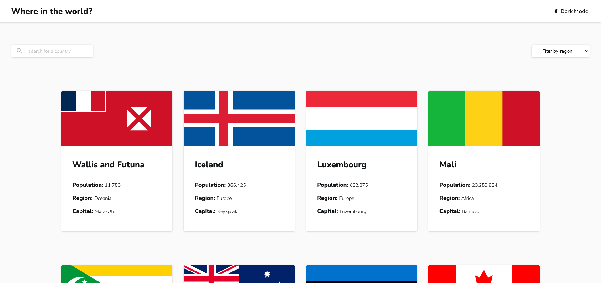

# Frontend Mentor - REST Countries API with color theme switcher solution

This is a solution to the [REST Countries API with color theme switcher challenge on Frontend Mentor](https://www.frontendmentor.io/challenges/rest-countries-api-with-color-theme-switcher-5cacc469fec04111f7b848ca). Frontend Mentor challenges help you improve your coding skills by building realistic projects.

## Table of contents

- [Overview](#overview)
  - [The challenge](#the-challenge)
  - [Screenshot](#screenshot)
  - [Links](#links)
- [My process](#my-process)
  - [Built with](#built-with)
  - [What I learned](#what-i-learned)
  - [Useful resources](#useful-resources)
- [Author](#author)

## Overview

### The challenge

Users should be able to:

- See all countries from the API on the homepage
- Search for a country using an `input` field
- Filter countries by region
- Click on a country to see more detailed information on a separate page
- Click through to the border countries on the detail page
- Toggle the color scheme between light and dark mode *(optional)*

### Screenshot



### Links

- Solution URL: [Github](https://github.com/tenderking/rest-countries-api)
- Live Site URL: [Vercel](https://rest-countries-api-livid.vercel.app/)
- Frontend Mentor Profile: [tenderking](https://www.frontendmentor.io/profile/tenderking)

## My process

### Built with

- Semantic HTML5 markup
- CSS custom properties
- Flexbox
- CSS Grid
- Mobile-first workflow
- [Nuxt 3](https://nuxt.com/) - Vue framework
- [Sass](https://sass-lang.com/) - CSS preprocessor

### What I learned

During this project, I learned how to effectively use Nuxt 3 for server-side rendering and static site generation. I also improved my skills in using Sass for styling, which allowed for more organized and maintainable CSS. Additionally, implementing the color theme switcher deepened my understanding of state management in Vue.

```ts
import type { Country } from '~/types/Countries'
/* Reactive Variables */
const regionSelected = ref<string>('')
const searchQuery = ref<string>('')
const BASE_URL = 'https://restcountries.com/v3.1'
const nuxtApp = useNuxtApp()

const url = computed(() => {
  if (regionSelected.value) {
    return `${BASE_URL}/region/${regionSelected.value}`
  }
  else if (searchQuery.value) {
    return `${BASE_URL}/name/${searchQuery.value}`
  }
  else {
    return `${BASE_URL}/all`
  }
})

/* Fetch Data */
const { pending, data } = await useFetch<Country[]>(url, {
  headers: {
    Accept: 'application/json',
  },
  getCachedData(key) {
    return nuxtApp.payload.data[key] || nuxtApp.static.data[key]
  },
})

/* Watchers */
watch(regionSelected, () => searchQuery.value = '')
watch(searchQuery, () => regionSelected.value = '')
onMounted(() => {
  document.documentElement.scrollTop = 0
})
```
Here the data will get fetch only if the url changes. otherwise it will keep the data in cache. The watchers check if the select button or text input have been chaned.

### Useful resources

- [Nuxt Documentation](https://nuxt.com/docs/getting-started/introduction) - This was an invaluable resource for understanding the framework and getting started with the project.

## Author

- Frontend Mentor - [@tenderking](https://www.frontendmentor.io/profile/tenderking)
